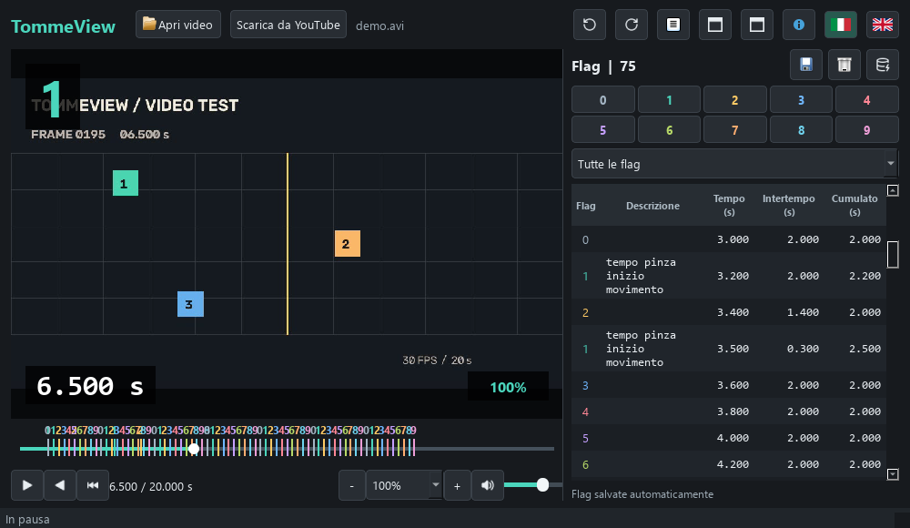

# TommeView TimeLens

### Watch the video. Mark the events. Measure the time.

[Italiano](README.md) · [English manual](manual.en.md) · [Installation](INSTALLATION.md) · [Third-party licenses](THIRD_PARTY_LICENSES.md)

*Screenshot uses synthetic test footage, not bundled with the installer.*

TommeView is a Windows video player for manual timing analysis in engineering.
Slow down footage, navigate to an event and mark it. Different numeric labels
represent parallel processes; the table shows their intervals and cumulative times.

## Why it exists

After years without finding a player that combined the slow playback, precise
navigation and easy interval timing he wanted, Marco Tommesani built TommeView.
Its purpose is to examine machinery videos: individual operations, idle time,
performance and overlapping processes. It supports analysis of your own machines
or technical comparisons using footage you are entitled to use.

This is a manual observation tool, not automatic event recognition or certified
metrology. Results refer to the video's timeline: check recording speed, edits
and frame rate before interpreting them as real machine timings.

## What you can do

- Open local videos or drag them onto the window.
- Play forward or backward at 5%–1000%; jog with the wheel while paused.
- Create ten colored numeric tags with per-video multiline descriptions.
- Inspect same-tag intervals and cumulative times; filter and export CSV.
- Automatically save annotations locally and import older sessions.
- Rotate the video and use video-only or full-interface fullscreen.
- Switch between Italian and English.
- Acquire a single YouTube video for local analysis when permitted.

## Availability

Download **TommeView 1.6.4** from the [releases](https://github.com/TecnicaAliena/TommeView-TimeLens/releases) page. Third-party dependency source assets are separate from the installer; see [references](SOURCE_REFERENCES.md) and [delivery instructions](SOURCE_DELIVERY.md). Python and VLC are not required. Installation is per user; Explorer integration is optional.

## About the creator

I'm **Marco Tommesani**, known on GitHub as **TecnicaAliena**. I developed and
refined TommeView around a practical need: making machinery timing analysis
easier, including processes running in parallel.

## Support the project

If TommeView helps you, you can buy its creator a coffee or a beer. Thank you!

**[Support Marco on PayPal](https://paypal.me/marcotomme)**

[€1](https://paypal.me/marcotomme/1EUR) · [€3](https://paypal.me/marcotomme/3EUR) · [€10](https://paypal.me/marcotomme/10EUR)

Donations are voluntary. Links open PayPal; TommeView does not process payments.

## Responsible use and feedback

Annotations remain local. YouTube acquisition contacts external services and
requires checking applicable terms, rights and permissions. Public availability
or personal use alone does not authorize downloading. The form requires an
explicit acknowledgement; it is not a blanket liability waiver. TommeView is not
affiliated with or endorsed by YouTube.

For problems, include the application/Windows versions and reproducible steps.
Do not upload confidential videos, personal annotations or credentials.
See [support](SUPPORT.md).

This repository contains public documentation, not application source or private
history. See [rights and third-party components](RIGHTS.md).
